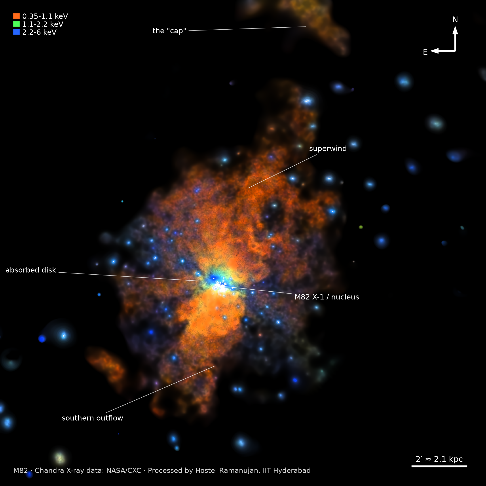

# M82 in X-rays

Hostel Ramanujan's entry for the Astro-Photography Competition at Milan 2026, IIT Hyderabad, organised by Cepheid. This repository turns seven raw Chandra X-ray images of the starburst galaxy Messier 82 into one colour image, and builds the stacking report.

Team: Piyush Anand (CS25MTECH12009), Darshanraj Pattanaik (CS25MTECH12002)



The image covers 18' x 18' at 0.492" per pixel, with north up and east left. Colour encodes X-ray energy: orange is 0.35-1.1 keV, green is 1.1-2.2 keV and blue is 2.2-6 keV.

## Contents

- [Results](#results)
- [The data](#the-data)
- [Method](#method)
- [Repository layout](#repository-layout)
- [Reproducing the results](#reproducing-the-results)
- [Parameters](#parameters)
- [Limitations](#limitations)
- [Credit and references](#credit-and-references)

## Results

| File | Description |
|---|---|
| `outputs/final/M82_Chandra_wide_Ramanujan.png` | Submitted image, 2200 x 2200 px (also `.tif` 16-bit master and `.jpg`) |
| `outputs/final/M82_Chandra_core_Ramanujan.png` | Close-up of the centre, 6.9' across |
| `outputs/final/M82_Chandra_annotated_Ramanujan.png` | Wide image with labels, scale bar and compass |
| `outputs/figures/fig1..fig5` | Figures used in the report |
| `report/M82_Stacking_Report_Ramanujan.pdf` | Full stacking report (9 pages) |

Adaptive smoothing, compared with fixed Gaussian blurs on the same region of the wind:

| Method | Sky RMS | Wind S/N per pixel | Point source FWHM (px) |
|---|---|---|---|
| Raw | 0.439 | 0.64 | 8.8 |
| Gaussian 1 px | 0.128 | 2.21 | 8.0 |
| Gaussian 2 px | 0.070 | 4.03 | 8.8 |
| Gaussian 4 px | 0.046 | 6.18 | 11.2 |
| Gaussian 8 px | 0.038 | 7.59 | 14.6 |
| **Adaptive** | **0.034** | **8.41** | **8.2** |

The adaptive version gets a higher signal-to-noise than an 8 px blur while keeping point sources as sharp as in the raw data.

## The data

Seven FITS files from the Chandra X-ray Observatory (ACIS), one per energy band, each 3072 x 3072 pixels of photon counts at 0.492" per pixel. The field is a mosaic of several pointings. No exposure maps were supplied.

| Band | Photons | Share | Main content |
|---|---|---|---|
| 350-500 eV | 42,314 | 2.2% | O VII / O VIII lines, coolest wind gas |
| 500-700 eV | 142,811 | 7.3% | O and Fe-L lines, soft thermal wind |
| 700-1100 eV | 642,433 | 32.9% | Fe-L and Ne lines, brightest band |
| 1100-1600 eV | 409,454 | 20.9% | Mg and Ne lines, warm gas |
| 1600-2200 eV | 264,866 | 13.5% | Si lines, hot gas near the starburst |
| 2200-2800 eV | 115,446 | 5.9% | S lines and hard continuum |
| 2800-6000 eV | 337,617 | 17.3% | Hard continuum: X-ray binaries, absorbed nucleus |
| **Total** | **1,954,941** | 100% | |

Even after summing all bands, 87% of the pixels inside the observed area hold no photon, so the noise is Poisson (shot) noise.

## Method

The files are not repeated exposures to align and average. They are one image per energy band, already on the same grid. Stacking here means combining the bands, and handling the photon noise without blurring the point sources.

1. **Alignment check and stacking.** All seven headers have identical coordinate keys. Phase cross-correlation of each band against the all-band sum found offsets of 0.00 px, so no band is resampled. Brightness is the plain sum of all bands, which keeps Poisson statistics and gives every photon equal weight.
2. **Exposure map and background** (`01_prep.py`). The exposure is estimated from the 2.8-6 keV band, where the detector's particle background dominates away from the galaxy. Sources and the galaxy are masked, the hole is filled with a Laplace fill, and each band's background is measured beyond 1200 px from the centre. This removes the seams between mosaic pointings: the scatter of the sky level between blocks falls from 64% to 30%. A 974-pixel zero-count strip next to M82 X-1 (about 11,900 photons expected from its surroundings) is filled in from neighbouring pixels.
3. **Adaptive smoothing** (`02_adaptive_smooth.py`). Similar to CIAO `csmooth` (Ebeling et al. 2006). For each pixel, the smallest Gaussian from 0.5 to 32 px is kept at which the signal is significant above the background. Brightness uses a threshold of 6 sigma, and colour uses a stricter 15 sigma. One kernel map is applied to every band, so colour ratios come from equally smoothed data.
4. **Colour** (`03_compose.py`). Three energy groups are mapped to orange, green and blue. The colour layer is blurred further (LRGB principle), and only colour ratios are applied to the stretched brightness (Lupton et al. 2004), so the stretch does not shift hues.
5. **Stretch and finishing.** asinh stretch, non-local-means denoising in the diffuse gas only, local contrast, light sharpening only on compact sources, saturation that eases in with brightness, highlight roll-off to white, and export as 16-bit TIFF, PNG and JPEG.
6. **Figures and report** (`04_figures.py`, `05_report.py`). Every number in the report is read from the pipeline's own output.

The whole image is produced by the scripts. No manual painting, masking or retouching was used.

## Repository layout

```
.
├── pipeline/
│   ├── config.py               all parameters
│   ├── common.py               FITS I/O, FFT smoother, stretch and export helpers
│   ├── 01_prep.py              coverage, exposure map, background, data gap, alignment check
│   ├── 02_adaptive_smooth.py   adaptive smoothing of brightness and colour layers
│   ├── 03_compose.py           colour composite, stretch, finishing, export
│   ├── 04_figures.py           report figures and annotated image
│   └── 05_report.py            builds the PDF report
├── outputs/
│   ├── final/                  final images
│   └── figures/                report figures
├── report/                     stacking report (PDF)
├── run_all.sh                  runs the full pipeline
└── requirements.txt
```

## Reproducing the results

Requirements: Python 3.12 or newer. WeasyPrint also needs the Pango library from your system package manager (for example `sudo apt install libpango-1.0-0 libpangoft2-1.0-0`).

1. Download the seven M82 band images from the Chandra archive (https://chandra.harvard.edu/) and put them in a folder named `Astrophotography Raw FITS/` at the repository root, with these names:

   ```
   m82_350_500_eV.fits    m82_500_700_eV.fits    m82_700_1100_eV.fits
   m82_1100_1600_eV.fits  m82_1600_2200_eV.fits  m82_2200_2800_eV.fits
   m82_2800_6000_eV.fits
   ```

2. Create the environment and run the pipeline:

   ```bash
   python3 -m venv .venv
   .venv/bin/pip install -r requirements.txt
   ./run_all.sh
   ```

The full run takes about two minutes and rebuilds `work/` (intermediate files, about 600 MB), `outputs/` and `report/`.

## Parameters

All settings are in `pipeline/config.py`. The main ones:

| Name | Value | Meaning |
|---|---|---|
| `SCALES` | 0.5 to 32 px (13 steps) | Gaussian kernel sizes tried per pixel |
| `SNR_LUM` / `SNR_COLOUR` | 6 / 15 | Significance thresholds for brightness and colour |
| `SCALEMAP_MEDIAN` | 5 | Median filter on the kernel map, removes noise-driven small kernels |
| `EXPOSURE_BAND` | 6 (2.8-6 keV) | Band used to estimate the exposure map |
| `BKG_FIT_R` | 1200 px | Background measured only beyond this radius |
| `COLOUR_BLUR` | 5 px | Extra blur on the colour layer |
| `SATURATION` | 1.45 | Saturation boost |
| `SOFT_NSIG` | 1.1 (wide), 12 (core) | asinh softening in units of sky noise |
| `WHITE_PCT` | 99.995 (wide), 99.98 (core) | White point percentile |

The report's appendix lists every parameter.

## Limitations

- The exposure map is estimated from the data. The observation files needed to compute it properly were not provided.
- No deconvolution was applied. Sources far from the centre look larger because Chandra's resolution drops off-axis.
- M82 X-1 is piled up, so its brightness and colour are not reliable.
- X-rays have no visible colour. The colours are a mapping from energy.

## Credit and references

X-ray data: NASA / Chandra X-ray Center, Chandra X-ray Observatory (https://chandra.harvard.edu/). The data were not captured by Cepheid or by the authors. The processed images must not be shared without this credit.

- Ebeling, White and Rangarajan 2006, MNRAS 368, 65 (adaptive smoothing)
- Lupton et al. 2004, PASP 116, 133 (colour composites)
- Buades, Coll and Morel 2005, CVPR (non-local means)
- Strickland and Heckman 2009, ApJ 697, 2030 (M82 superwind)
- Lehnert, Heckman and Weaver 1999, ApJ 523, 575 (the cap)
- Bachetti et al. 2014, Nature 514, 202 (M82 X-2)
